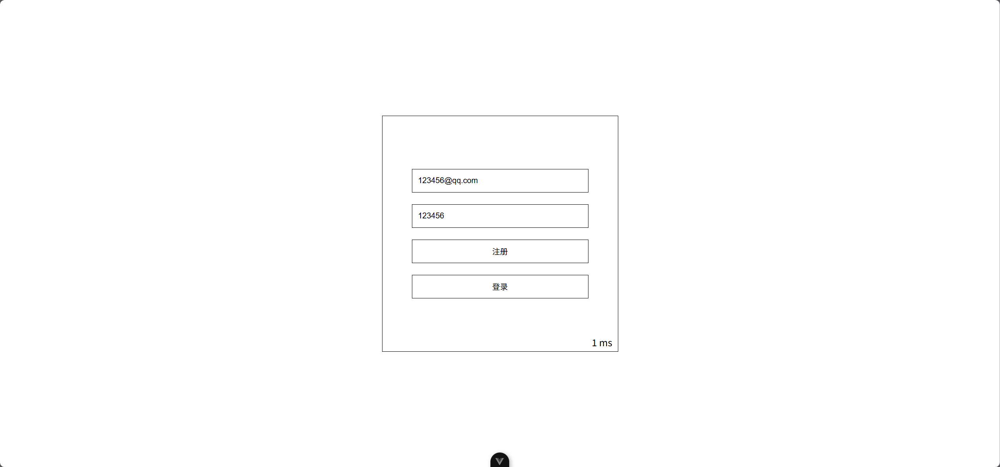
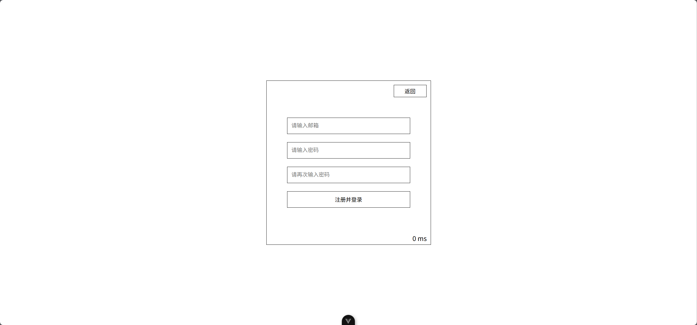
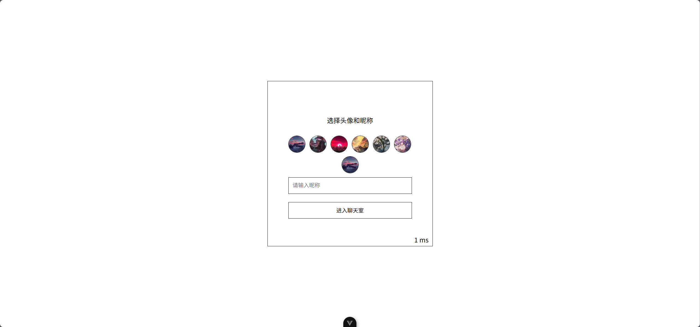
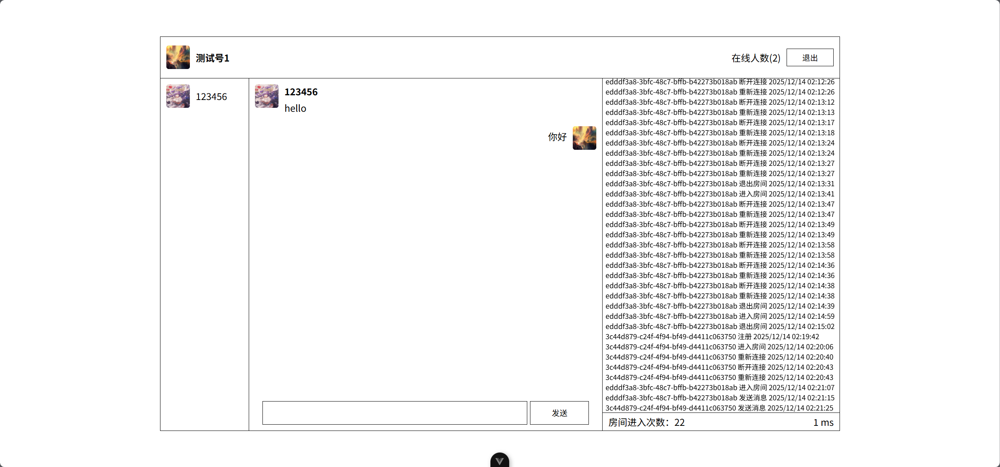

## 简易聊天室客户端

### 介绍

简易的聊天室客户端，使用 vue3 编写，全程 websocket 连接，基于 socket.io 实现。

### 效果图

<table>
    <tr>
        <td ><center>图1</center></td>
        <td ><center>图2</center></td>
    </tr>
    <tr>
        <td ><center>图3</center></td>
        <td ><center>图4</center></td>
    </tr>
</table>

### 功能

- 登录
- 注册
- 发送消息
- 接收消息
- 身份认证
- 文件数据存储
- 更新推送

预览地址：[http://69.197.140.41:3000/](http://69.197.140.41:3000/)

### 安装依赖

```
npm install
```

### 运行

```
npm run dev
```

### 访问

打开浏览器，访问 `http://localhost:5173/` 即可进入聊天室。

### 其他

客户端代码请参考 [chat-room-client](https://github.com/OnZeng/chat-room-client)。
服务器端代码请参考 [chat-room-server](https://github.com/OnZeng/chat-room-server)。
